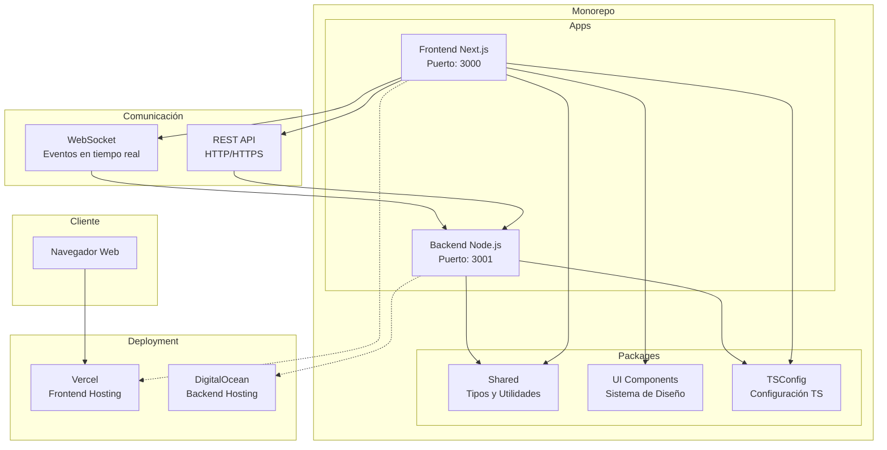

# Arquitectura del Sistema de Gestión de Órdenes

## Diagrama de Arquitectura



## Estructura del Monorepo

```
muta-technical-test/
├── apps/
│   ├── backend/          # API Node.js con Express y Socket.io
│   │   ├── src/
│   │   │   ├── services/ # Lógica de negocio
│   │   │   ├── routes/   # Endpoints REST
│   │   │   └── index.ts  # Punto de entrada
│   │   └── Dockerfile    # Para DigitalOcean
│   │
│   └── frontend/         # App Next.js con TypeScript
│       ├── src/
│       │   ├── pages/    # Páginas de Next.js
│       │   ├── components/ # Componentes React
│       │   └── hooks/    # Custom hooks
│       └── vercel.json   # Configuración Vercel
│
├── packages/
│   ├── shared/           # Tipos y utilidades compartidas
│   ├── ui/               # Componentes UI reutilizables
│   └── tsconfig/         # Configuraciones TypeScript
│
├── turbo.json            # Configuración de Turborepo
├── pnpm-workspace.yaml   # Configuración de workspaces
└── package.json          # Scripts del monorepo
```

## Flujo de Datos

1. **Inicialización**: 
   - El frontend se conecta al backend vía WebSocket
   - El backend envía las órdenes iniciales

2. **Actualizaciones en Tiempo Real**:
   - El backend simula cambios en las órdenes cada 3-10 segundos
   - Los cambios se emiten a todos los clientes conectados vía WebSocket
   - El frontend actualiza la UI automáticamente

3. **Filtrado y Búsqueda**:
   - Los filtros se aplican localmente en el frontend
   - Opcionalmente se pueden hacer peticiones REST para filtrado server-side

## Tecnologías Utilizadas

### Backend
- **Node.js + Express**: API REST
- **Socket.io**: Comunicación en tiempo real
- **TypeScript**: Type safety
- **Jest**: Testing

### Frontend
- **Next.js 14**: Framework React
- **TypeScript**: Type safety
- **Tailwind CSS**: Estilos
- **Chart.js**: Visualizaciones
- **Socket.io-client**: WebSocket client
- **next-i18next**: Internacionalización
- **Jest + React Testing Library**: Testing

### Herramientas de Desarrollo
- **Turborepo**: Build system y caché
- **pnpm**: Gestor de paquetes
- **ESLint**: Linting
- **Prettier**: Formateo de código
- **Husky**: Git hooks

## Características Implementadas

1. **Backend**:
   - Simulación de órdenes con 5 estados posibles
   - WebSocket para eventos en tiempo real
   - API REST para consultas y filtrado
   - Generación automática de datos

2. **Frontend**:
   - Tabla de órdenes actualizada en tiempo real
   - Filtros por estado y búsqueda por texto
   - Gráficos de barras y circulares
   - Soporte para español e inglés
   - Componentes reutilizables
   - Diseño responsive

3. **Monorepo**:
   - Código compartido entre proyectos
   - Builds optimizados con caché
   - Desarrollo paralelo
   - Configuración unificada